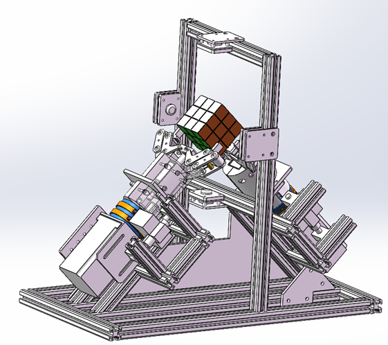
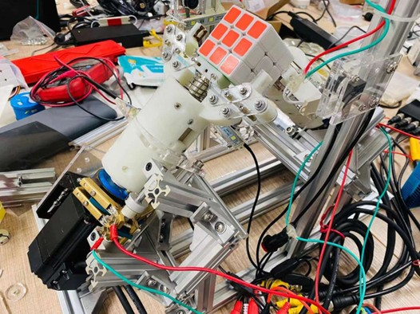
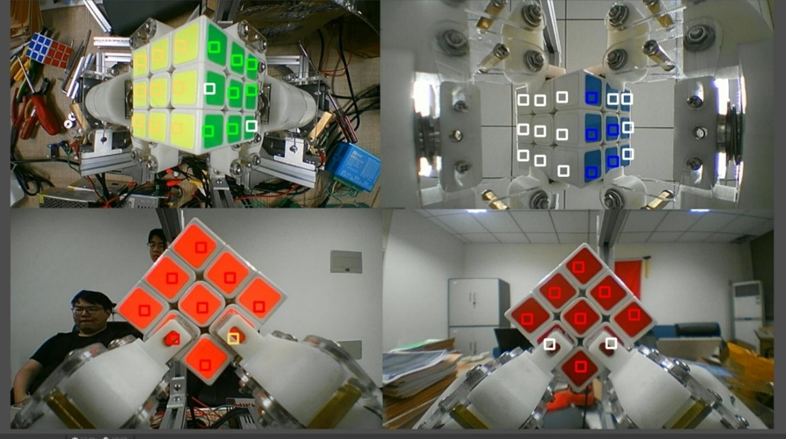

# Cube-Solving-Robot-TJU

# 源代码、数据、结构正在整理上传中（Under development）

## 项目概述
`Cube-Solving-Robot-TJU` 是一个自动化魔方机器人，能够通过颜色识别和魔方还原算法，快速高效地还原打乱的魔方。该项目结合了图像识别、计算机算法、机械控制系统与硬件设计，目标是在比赛中完成魔方的自动还原，提升机器人的速度与精度。

该项目的魔方机器人采用了双臂和二指设计，符合比赛的具体要求，旨在通过精确的颜色识别、快速高效的魔方解法和精密的机械结构来实现比人类更快速和准确的魔方还原。


|  |  |
| ------------------------------------------------------------ | ------------------------------------------------------------ |
|  |  |

## 比赛要求
根据比赛规则，本项目的魔方机器人满足以下要求：
- **双臂设计**：机器人使用双臂系统来操作魔方。
- **手指形式**：手指设计为二指形式，符合比赛的限制。
- **手腕转动与摆动**：手腕部分允许转动和摆动，以便完成魔方的操作。
- **固定手臂**：手臂本身是固定的，不会移动。
- **外形尺寸限制**：机器人的外廓尺寸不超过 480mm * 480mm * 480mm。
- **重量限制**：总重量不超过 20kg。
- **摄像头**：摄像头数量不限，机器人可自行增设光源。
- **魔方**：竞赛使用标准三阶魔方，决赛用魔方由组委会统一提供。

## 项目功能
- **颜色识别**：通过多个摄像头实时捕捉魔方的颜色块信息，并通过卷积神经网络（CNN）和机器学习算法实现高精度的颜色分类。
- **魔方还原算法**：使用二阶段算法（Kociemba's Algorithm）来解魔方，保证了在短时间内得到一个不超过20步的最优解。
- **控制系统**：使用Arduino控制系统，通过PWM调速步进电机和电磁铁控制机械臂与手爪精确执行魔方还原动作。

## 核心部件
### 1. 颜色识别系统
- **摄像头**：使用四个720P广角摄像头对魔方进行实时拍摄，每个摄像头负责不同角度的色块采集。
- **图像处理**：为了确保颜色识别的准确性，图像会经过腐蚀操作，以去除反光和噪点。使用基于CNN的深度学习模型进行颜色分类，确保高精度的识别，尤其在不同光照条件下。

### 2. 魔方还原算法
- **Kociemba算法**：该算法通过将魔方还原过程分为两个阶段，首先寻找一个阶段一的解，再通过阶段二的搜索得到完整的解。Kociemba的算法可以在几毫秒内生成一个最优解，平均不超过20步。
- **错误校验机制**：为了防止颜色识别误差导致的失败，系统会对魔方状态进行校验，确保颜色数据的准确性。若识别结果不符合标准，系统会自动重新识别。

### 3. 控制系统
- **Arduino控制板**：作为机器人“大脑”，接收并解析从计算机传输的还原步骤指令，控制步进电机、继电器、电磁铁等执行部件。
- **步进电机和电磁铁**：通过步进电机精确控制机械臂的旋转角度，电磁铁则负责操控机械手爪的开合。电磁铁的反应时间控制在15ms以内，确保动作迅速。

### 4. 执行系统
- **机械臂**：机械臂由3D打印技术制作，采用推拉式电磁铁驱动，提供高效、稳定的夹取动作。
- **手爪**：手爪采用电磁铁控制，具有极高的精度和反应速度，能够迅速夹取或松开魔方。

## 项目结构
```bash
Cube-Solving-Robot-TJU/
├── docs/          # 项目文档
│   ├── overview.md         # 系统概述
│   ├── hardware.md         # 硬件结构
│   ├── algorithm.md        # 算法设计
│   └── results.md          # 测试与结果
├── src/           # 代码源文件
│   ├── color_recognition/  # 颜色识别相关算法
│   │   ├── color_detection.py
│   │   └── cnn_model.py    # CNN模型代码
│   ├── cube_solver/        # 魔方还原算法
│   │   ├── kociemba.py     # Kociemba算法实现
│   │   └── solver.py       # 其他还原算法
│   ├── control_system/     # 控制系统及执行系统
│   │   ├── arduino_control.py
│   │   ├── motor_control.py
│   │   └── electromagnet.py # 电磁铁控制
│   └── utils/              # 工具函数
│       └── image_processing.py
├── hardware/      # 硬件设计文件
│   ├── pcb_design/           # PCB设计文件
│   ├── schematics/           # 电路原理图文件
│   └── 3d_models/            # 3D打印模型
├── data/          # 数据文件，包括训练数据、日志等
│   ├── training_data/        # CNN训练数据
│   └── logs/                 # 运行日志
├── README.md      # 项目说明文件
└── LICENSE        # 项目许可证
```

安装与运行
-----

1. **安装依赖**：  
    该项目使用Python编写，依赖以下库：
    
    ```bash
    pip install -r requirements.txt
    ```
    
2. **运行颜色识别**：  
    运行颜色识别模块来进行魔方色块的提取与分类：
    
    ```bash
    python src/color_recognition/color_detection.py
    ```
    
3. **解魔方**：  
    使用Kociemba算法解决魔方，计算最优解：
    
    ```bash
    python src/cube_solver/solver.py
    ```
    
4. **控制执行系统**：  
    启动Arduino控制系统，并通过串口接收指令执行动作：
    
    ```bash
    python src/control_system/arduino_control.py
    ```
    

数据
--

### 颜色识别数据

为了训练CNN模型，我们使用了多个光照条件下的魔方色块图像数据集。该数据集经过标注，包含不同角度、不同光照条件下的RGB数据。数据集主要用于训练颜色分类模型，提高在真实环境中的识别精度。

### 算法结果

使用Kociemba算法解魔方时，项目会输出每一步的旋转指令，控制机械臂和电磁铁执行相关动作。经过测试，魔方还原时间平均为20秒，且还原正确率超过90%。

项目优势
----

1. **高精度颜色识别**：采用CNN和集成学习算法，确保了在不同光照环境下的高识别准确率。
    
2. **快速魔方解法**：通过Kociemba算法，能够在极短的时间内求解魔方的最优解，减少了机器人的运动时间。
    
3. **稳定高效的控制系统**：Arduino控制系统配合步进电机和电磁铁驱动，确保了机械臂和手爪的稳定性和精确性。
    
4. **可扩展性强**：模块化设计，使得系统易于维护和扩展，可以根据需要进行硬件或算法的升级。
    

可能改进的方面
-------

1. **机械结构精度**：不同材料的精度差异可能影响魔方还原的稳定性。未来可以优化机械手臂和手爪的设计，提升精度。
    
2. **光线强度变化**：自然光变化可能影响颜色识别的精度。可以通过增强光源稳定性来降低光线变化的影响。
    
3. **电磁铁反应速度**：虽然电磁铁的吸合时间已控制在15ms以内，但释放时间依然较长。未来可通过更换更高性能的电磁铁或优化电磁铁设计来进一步缩短反应时间。
    

许可证
---

本项目采用 MIT License 许可协议。

致谢
--

感谢所有开源工具和库对本项目的支持，尤其是`OpenCV`、`TensorFlow`、`Kociemba`库以及`Arduino`社区的贡献。

```

### 更新说明：
- **比赛要求**部分已经加入，明确列出了魔方机器人必须遵循的设计限制和条件。
- **仓库名称**改回 `Cube-Solving-Robot-TJU`，同时文档中的相关描述也已调整。
```
